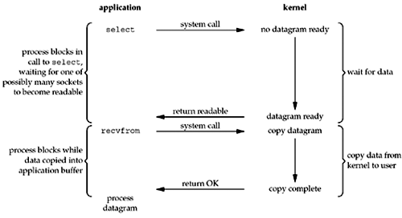

[TOC]

搞清楚 异步/同步,阻塞/非阻塞的问题
搞清楚  协程/fiber
goroutine/green thread/ucontext/tarsco的问题
select/epoll 的问题

https://github.com/Tencent/libco
https://www.gnu.org/software/libc/manual/html_mono/libc.html#System-V-contexts
https://github.com/cjhgo/fiber

python中的yield


**更加全面详细的对socket编程的介绍可以参看 Unix Network Programming Volume 1, Third Edition: The Sockets Networking API,unix网络编程 卷一,套接字联网API**
http://www.masterraghu.com/subjects/np/introduction/unix_network_programming_v1.3/toc.html
这里是这本书的在线版本.


## 网络IO模型:5种处理(等待+读写)socket的方式


在实际编写网络应用程序的时候,程序员都有哪些网络io模型可以选择呢?
step back and look at the bigger picture, examining the basic differences in the five I/O models that are available to us under Unix
大概有以下5种[^2].这种划分方式出自于
(Unix Network Programming Volume 1, Third Edition: The Sockets Networking API,unix网络编程 卷一,套接字联网API,Ch6,追根溯源知识还是出自于经典)

### 知识背景:事件的等待方式与通知方式


> there are normally two distinct phases for an input operation:
1.**Waiting for the data to be ready**
2.Copying the data from the kernel to the process
For an input operation on a socket, the first step normally involves waiting for data to arrive on the network. 
When the packet arrives, it is copied into a buffer within the kernel. 
The second step is copying this data from the kernel's buffer into our application buffer.    


**在网络io的过程中,无论是读还是写,都存在着两个步骤:第一步,等待socket条件就绪(可读或可写);第二步从缓冲区中读或写.**
由于是通过网络传输协议进行io,因此第一个阶段等待socket可读/可写存在着很大的不确定性,是不可预期的,
这一点和磁盘io不一样,磁盘io是可以保证在一定时间内读写完成.
**明白网络io过程中存在两个阶段这一点很重要,因为阻塞/非阻塞,同步/异步就是分别用来描述这两个阶段的.即是否阻塞等待可读写;可读写之后是同步的进行还是异步的进行**
对于它们的之处见后边的具体解释.


不限于网络io的例子,抽象到`等待某个事件发生`这个操作中.
这个操作同样分为两个阶段(开始等待-long time-事件要发生-long time-事件完成)
阻塞/非阻塞是说等待过程中,如果我们是一直等就是阻塞,如果我们做其他事情+轮询就是非阻塞
同步/异步是说,如果事件完成是以通知(回调)的形式告知的,那么就是异步的,否则就是同步的
如果从事件发生到事件完成这个阶段是一个level,即要花时间,这种区别很明显
如果这个阶段是一个edge,即不花时间,事件发生就标识着事件完成,那么这种区别不明显.


### blocking I/O(阻塞io)

>the process calls recvfrom and the system call does not return until the datagram arrives and 
is copied into our application buffer, or an error occurs.


### nonblocking I/O(非阻塞io)
unpv1#ch16Nonblocking I/O


在示意图中,应用程序向内核忙轮询socket是否可以读写
如果这个应用程序是专用于某个socket的,那么这种方式是可行的
如果用这种方式同时处理多个socket,那它的缺点就很明显了
1. 当socket全都空闲的时候,busy polling显然会占用很高的cpu
2. 多个socket要多次向kernel进行询问

使用多路复用可以解决这些问题


### I/O multiplexing(多路复用io)

在非阻塞式网络io中,为了等到一个可读写的socket,需要我们不断的轮询.
要等待多个socket可读写,或者有多个user等待socket可读写,如果每个用户分别等待,整体效率很低.
因此,操作系统为用户提供了同时等待多个socket可读写的功能,也就是IO Multiplexing(多路复用IO).
这样对用户而言,可以同时等待多个socket可读写,对操作系统而言,可以集中等待多个user的socket,提高了整体的效率.


>With I/O multiplexing, we call select or poll and block in one of these two system calls, instead of blocking in the actual I/O system call.

通过多路复用,进程阻塞在poll这个系统调用上,而不是阻塞在实际的socket io系统调用上.
同时处理多个socket的时候,这种优势就能体现出来了.


操作系统提供的IO多路复用 api 有`select,poll,epoll`这几个.
它们的工作方式都是,user 提供FD_SET,发
>wait until one of these sockets is ready to give me some data, and tell me which ones are ready.

可读写的时候存在着边缘触发和水平触发的区别
关于多路复用最详细的解释当然是来自它们的官方manpage
### signal driven I/O(信号驱动io)
unpv1#Chapter25Signal-Driven I/O


>We first enable the socket for signal-driven I/O and 
install a signal handler using the sigaction system call. 
The return from this system call is immediate and our process continues; 
it is not blocked. 
When the datagram is ready to be read, the SIGIO signal is generated for our process. 
We can either read the datagram from the signal handler by calling recvfrom and then notify the main loop that the data is ready to be processed , 
or we can notify the main loop and let it read the datagram.<br>
Regardless of how we handle the signal, 
the advantage to this model is that we are not blocked while waiting for the datagram to arrive. 
The main loop can continue executing and 
just wait to be notified by the signal handler that 
either the data is ready to process or the datagram is ready to be read.

通过`sigaction`系统调用给进程安装一个信号处理程序,
然后让kernel通过信号的方式通知我们socket可以读写了

在信号通知的方式中,我们不需要去检查文件描述符是否可读写,操作系统在Fd可读写的时候会向我们发出信号.

由于信号通知具有随机性,需要中断当前程序,因此这种机制一般都是轻量级地使用.

### asynchronous I/O(异步io)


> these functions work by telling the kernel to start the operation and 
to notify us when the entire operation (including the copy of the data from the kernel to our buffer) is complete

信号通知机制在可读写的时候发信号,读写的过程还是同步的.AIO则在读写完成后才发通知,整个都是异步的.

aio对socket的支持并不好,所以这种方式在实际编程中是很少用的.


### 同步IO与异步IO

IO Models Comparison
这五中I/O模型中,前四种的第一步骤各有不同,但是第二个步骤都一样的都需要我们自己去I/O(同步的)
但是异步I/O模型则不同
它是由内核帮忙I/O然后通过信号通知程序,也就是
当程序收到信号的时候我们就可以直接去处理数据了,不用再去从socket中拷贝数据到应用层buffer中


POSIX对同步io与异步io的定义如下:

+ A synchronous I/O operation causes the requesting process to be blocked until that I/O operation completes.

+ An asynchronous I/O operation does not cause the requesting process to be blocked.

按这个定义,前四种io model都属于同步io,最后一个是异步io.

## 概念澄清:阻塞/非阻塞,同步/异步
异步/同步,阻塞/非阻塞的区别是什么?

### 计算机科学中的异步/同步

首先,我们要指出这里讨论的是网络io场景下的同步/异步,阻塞/非阻塞问题.
因为在计算机科学中,同样的名词在不同的场景下其意义完全不同,因此脱离语境是无法具体的讨论某一个名词的具体涵义的.
另外还有些场景下,某个名词描述的是某些词汇缩写之后的特定的语义,而不是字面的意思.
*In many circumstances they are different names for the same thing, but in some contexts they are quite different.
Terminology is not applied in a totally consistent way across the whole software industry.*
所以不要脱离场景,去尝试理解一个名词
比如异步io:
我们这里讨论的是网络io场景,具体而言就是使用socket进行通信的网络应用程序.这可以是一个聊天软件在收发包,也可以是一个http server在和client交互.

当我们说进程需要同步的时候,我们说的是进程各个部分的执行顺序的控制,步调的控制
当我们说同步计算/异步计算的时候,
当我们说rpc同步调用/异步调用的时候,也有同步网络模型和异步网络模型之分别

### 区分非阻塞与异步

以从socket中读数据为例.
从socket中读数据,第一步首先要socket可读.
只有当socket的另一方发送了数据的时候,socket才会变为可读状态.但是socket另一方何时会发送数据,这一点是很不确定的.
阻塞/非阻塞就是用来描述第一步的时候调用者是否等待socket可读.
+ 阻塞式的网络io会一直block到另一方发送了数据,socket可读;
+ 非阻塞的网络io如果socket不可读,会立即返回EWOULDBLOCK,因此不必block.
(socket不可读,调用立即返回,但是最终还有等待到一个可读的socket,因此就要不断的尝试,也就是轮询)

无论是通过block/non-block的方式,最终我们都得到了可读的socket,此时就进入第二步,从缓存区中读(拷贝)数据.
或者是数据比较多,或者是网络质量比较差,这个过程同样也会是一个耗时的操作.
从缓冲区中读数据同样有两种方式.[^0]
+ 同步式读数据,
从内核拷贝到用户空间的这个阶段,如果从开始拷贝直到拷贝结束,read函数才返回,则称为同步IO.
+ 异步式读数据
如果在调用read的时候就直接返回了,等到数据拷贝结束,才通过某种方式(例如回调)通知到用户,这种被称为异步IO


需要指出的是Linux平台并没有提供实用的异步io API.因此并没有一种实用的`非阻塞异步io`方案.
(Linux提供了异步io API叫做aio,但是支持性不好;Windows平台提供了异步io的API,I/O Completion Ports,简称iocp)
(`阻塞异步io`这种组合很不实用).
所以,虽然这两个阶段有4种组合,但是实际上我们常用到的只有`阻塞同步,非阻塞同步`这两种网络io.

**那么,最终,它们有什么区别呢?**
>Asynchronous and non-blocking I/O are the opposites of synchronous and blocking. 
In a sense both are fairly similar in that they allow your code to make an API call in a way that does not hold up the entire thread of execution. But they are also different because asynchronous calls usually involve a callback or an event, to signal that the response is available, while in the case of non-blocking the call returns with whatever is available and the caller might have to try again to get the rest of the data. The word non-blocking is usually used with I/O, while asynchronous is used in a more generic sense with a broader range of operations.[^1]

翻译一下,就是异步和非阻塞有相似的地方在于说遇到耗时的操作时,我们不会陷入等待状态这种处理方式.
它们的区别在于
非阻塞调用有什么就返回什么,调用者可能要重试.异步调用一般涉及到回调或信号通知来表明事件有了结果.
非阻塞一般用来描述io操作,异步使用 的场合就更加地宽泛.


## 框架和语言对io的抽象封装
### 异步IO及基于协程的异步编程
回调风格的异步编程如何实现
协程如何取代callback
```py
from tornado.concurrent import Future

@gen.coroutine
def async_fetch_gen(url):
    http_client = AsyncHTTPClient()
    response = yield http_client.fetch(url)
    raise gen.Return(response.body)


def async_fetch_manual(url):
    http_client = AsyncHTTPClient()
    my_future = Future()
    fetch_future = http_client.fetch(url)
    def on_fetch(f):
        my_future.set_result(f.result().body)
    fetch_future.add_done_callback(on_fetch)
    return my_future
```
### 两种高性能I/O设计模式:reactor/proactor
Reactor io 模型:多路复用,当有可读写事件发生的时候做出通知,用户来复制读写, epoll就是一种例子
Proactor io 模型:多路复用,当读写完成的时候做出通知,操作系统复制读写,真正的异步,windows的iocp是这样一种例子
这两者都属于用于事件处理的设计模式,event-driven-loop.
不同之处在于[^4]
Reactor在事件发生的时候发通知,Proactor更加彻底,事件完成之后发通知
Reactor注册的是发生回调;Proactor注册的是完成回调.
Reactor配合同步io使用;Proactor配合异步io使用.


https://tech.youzan.com/yi-bu-wang-luo-mo-xing/


## io模型与C10K,怎样同时处理多个socket
前边描述的是我们编写网络应有程序读写socket能够采取的io模型.
我们在实现一个服务端程序的时候,这种IO模型往往直接影响了我们架构的选择.
在处理socket方面,我们要求服务端程序能同时够尽可能多的处理来自客户端的socket读写,也就是要求能够提供较高的并发量,整个架构有较好的可扩展性.
我们的服务器也许只有1-100这样数量级别的核数,但是我们希望系统能够并发地处理10k个这样数量级别的客户端socket读写.
这就是c10k问题[^3].我们有哪些手段可以使用呢?
`多核并行+多线程/多进程/多路复用`

总结起来,我们的服务端处理c10k有以下几种方案[^2]:

+ 单线程处理多个socket,水平触发可读写通知/边缘触发可读写通知
非阻塞IO+事件循环(event loop)+轮询(polling)
通过多路复用,一个线程就可以同时等待处理多个socket.
多核服务器 ,可以每个核都维护一个event loop.
系统需要在多个核之间作负载均衡处理.
不过,这种架构逻辑要复杂一点
Nginx/Nodejs/Nettyu使用这种架构.
+ 单线程处理多个socket,异步触发读写完成通知
+ 一个线程处理一个socket
阻塞IO+多线程(线程池)
当使用阻塞IO的时候,一般使用线程池技术来提供并发量.
这种架构的优点是概念简单,逻辑简单,线程隔离.
缺点是线程池的数目和线程stack的size会成为整个系统的瓶颈.
Apache使用这种架构
+ 在内核态实现服务端代码
+ 在用户态实现tcp网络协议栈

- [x] 我又看到了一个hahs/lf模式
半同步/半异步(Half-Sync/Half-Async)和领导者/追随者(Leader/Follower) 模式
https://iunknown.iteye.com/blog/59804
https://www.dre.vanderbilt.edu/~schmidt/PDF/PLoP-95.pdf

### 知识实践
使用epoll/libevent实现一个http-server
单线程处理多个socket

协程

本文参考了这些文章.
进一步的学习,请好好翻看unix network programming,而不是看二手的blog
http://www.masterraghu.com/subjects/np/introduction/unix_network_programming_v1.3/toc.html


[^0]:http://cyhone.com/2018/11/04/reunderstanding-of-non-blocking-io

[^1]:http://www.programmr.com/blogs/difference-between-asynchronous-and-non-blocking

[^2]:http://seenaburns.com/network-io

[^3]:http://www.kegel.com/c10k.html

[^4]:https://www.artima.com/articles/io_design_patterns.html