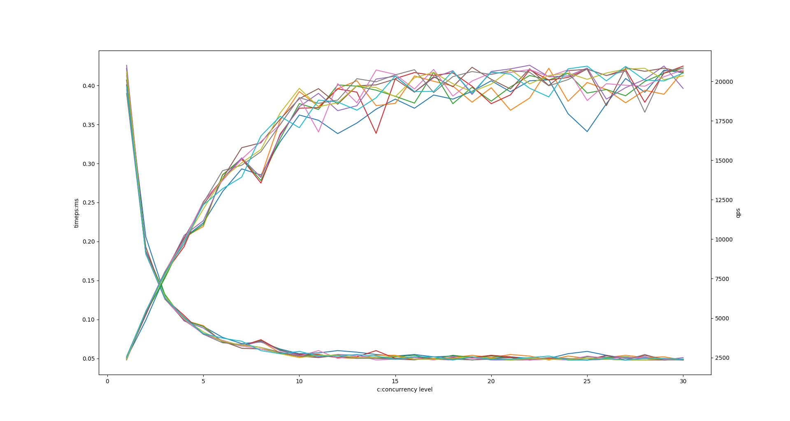

### 基于reactor模型实现一个简单的echo server

主线程不断检查可读事件,子线程处理可读事件.
可读事件有两种,server socket可以accept, client socket可以read.
server_fd可读,说明有新的链接进来;client_fd可读,说明客户端发来了数据

1. create/bind/listen server socket, 创建server socket`server_fd`
`server.start(); 启动server的listen`
2. epoll_create 创建epoll 实例
3. 向epoll实例注册server_fd的可读事件
4. 启动线程池不断从fd_queue中取可读fd
(这里线程池可以有不同的设计
是一个通用的线程池,传入自定义的处理程序
还是一个专用的线程池,把fd和处理程序都封装好放入到线程池的队列中?
即*线程池的queue中究竟应该放什么?*
是fd?还是fd+data?还是callable?
目前先放一个callable吧)
    1. 如果取到`fd==server_fd`,则说明有新的链接进来,执行`client=accept4`,
    向epoll实例注册这个client的边缘触发可读事件
    2. 取到的不是server_fd,则说明clinet发来了数据,读数据然后echo
    这里由于是简单的echo server,所以不考虑一次没读完的情况,
    认为无论多多少就是完整的消息内容
    然后也不考虑echo的时候一次没有send完的情况
    认为send了无论多少,都是完成了send,**然后关闭链接**
    即echo是一个短连接服务,ping-pong-ping,收什么返回什么,然后close
    但是,
    **对于非阻塞套接字,如果发送的内容较长,考虑的情况其实就比较复杂**
    一次没发完,要把剩下没发的存起来,等待下次可写事件的发生
    可是函数这个时候已经要执行结束了,下次怎么知道这次剩下什么没发送呢?
    所以,显然对于要多次读写的socket用函数处理是不够的,
    这些socket要用一个tcpconnection类来表示,
    把这些没发送完的数据关联到类中
5. 启动主线程的io-loop,用epoll_wait不断检查是否有可读事件发生
无论哪一种事件,都是把xxx放入到线程池中.


```c
server.listen
pool.work
ioloop.run
```


